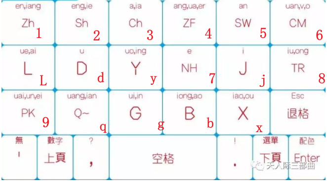

# irime-themes+方案
## 方案：格道17

```tree
├─theme+方案        
│  ├─opencc
│  └─theme       
│      ├─14key   
│      │  ├─land 
│      │  ├─port 
│      │  └─res  
│      └─gedao17 
│          └─port
```
`theme`中是格道17的 主题布局


`gedao.schema.yaml`文件内是 方案

# themes
收集的 irime 主题布局
xunfei.theme.yaml


4-rows.theme.yaml


simple-1.theme.yaml


number-plus.theme.yaml


jiugongge, 需要配合方案文件

